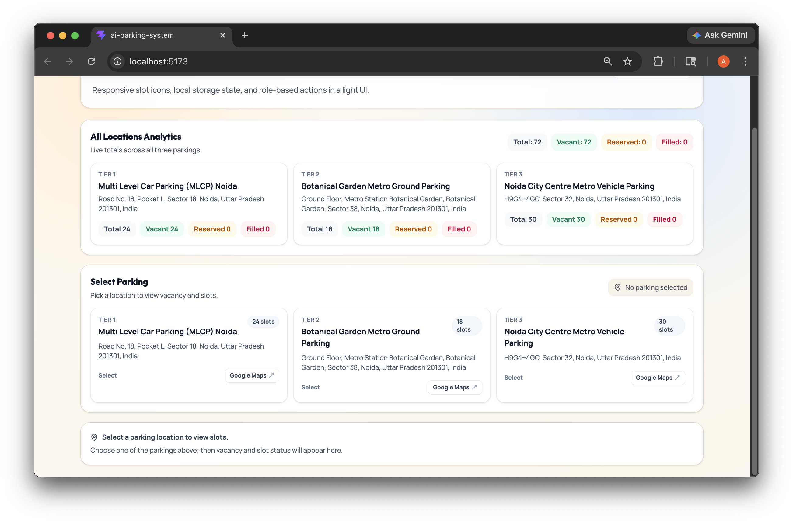

# 🅿️ AI Parking System

> **Smart parking, one tap away.** A hackathon MVP that turns parking chaos into a live, reserve-from-your-phone experience — with IoT sensors and ML camera detection planned as the next milestone.


---

## ⬇️ Download the Android APK (MVP demo build)

**[⬇️ Download AI-Parking-System-debug.apk](https://github.com/aadisthunder/AI-Parking-system/releases/latest/download/AI-Parking-System-debug.apk)** — latest MVP build from [GitHub Releases](https://github.com/aadisthunder/AI-Parking-system/releases).

| | |
|---|---|
| **File** | `AI-Parking-System-debug.apk` |
| **Package ID** | `com.aiparkingsystem.app` |
| **Requires** | Android 7.0+ (API 24), any phone |
| **Signing** | Debug key — for demo/testing only (not a Play Store build) |

**Install steps:** download the APK → open it on the phone → allow “Install unknown apps” when prompted → install → open **AI Parking System**.

**Demo logins**

| Role | Username | Password | What you can do |
|---|---|---|---|
| Admin | `admin` | `admin123` | See all locations, toggle slots filled/vacant, reset a lot |
| User | `user` | `user123` | Pick a location, reserve a vacant slot, cancel your reservation |
| New user | — | — | Self-register from the **User → Register** tab (password ≥ 4 chars) |

---

## 📸 Screenshot



*Admin dashboard: live totals across all three parking locations, slot counts, and location picker.*

---

## 💡 The idea (and why it matters)

Finding parking in dense Indian cities is a daily 10–20 minute time sink: drivers circle lots that are already full, while the same block's other lot sits half empty. The information gap — not the parking supply — is the problem.

**AI Parking System is a working MVP of the solution**: a mobile-first app that shows what is vacant, lets you reserve a slot before you drive, and gives operators a live occupancy view. Today it runs entirely on-device; the roadmap below turns it into a real deployed system by adding:

1. **IoT sensors** — one cheap sensor per slot reporting occupancy in real time.
2. **ML camera detection** — CCTV/ANPR cameras recognizing vehicles, plates, and vacant slots.
3. **An AI layer** — occupancy forecasting, smart routing to the nearest free slot, and dynamic pricing.

> This repository is intentionally an **MVP / idea-stage project**: the complete user experience and the app logic are implemented and shipped as an Android APK, while the hardware and ML integrations are the next planned milestone (designed for, but not yet wired in).

---

## ✅ What works today (the MVP)

| Area | Status | Details |
|---|---|---|
| Front-end UI | ✅ Implemented | Responsive React + Tailwind interface, built as a mobile-dark-friendly app shell |
| App logic (auth, slots, reservations, analytics) | ✅ Implemented | Runs fully client-side through a small state/service layer |
| Android app | ✅ Implemented | Capacitor 8 wrapper, debug APK published on Releases |
| Live server back-end (API + database) | 🚧 Next milestone | Currently a mock layer: data persists in `localStorage` on the device |
| IoT sensors | 🚧 Next milestone | Architecture defined below; no hardware wired yet |
| ML camera detection | 🚧 Next milestone | Plan and pipeline defined below; not yet integrated |

### Feature list

- **Role-based access** — separate **Admin** and **User** logins, plus self-registration for users.
- **3 real parking locations** (Noida) with tiers, addresses and Google Maps deep links:
  - *Multi Level Car Parking (MLCP), Sector 18* — 24 slots
  - *Botanical Garden Metro Ground Parking* — 18 slots
  - *Noida City Centre Metro Vehicle Parking* — 30 slots
  - **72 slots total** in the demo data.
- **Live slot grid** — every slot is `vacant` / `reserved` / `occupied`, colour-coded and tappable.
- **User flow** — select a location → see vacant/reserved/filled counts → tap a vacant slot to reserve → tap again to cancel. “My Reservations” tracks your own bookings; each slot keeps a reservation history.
- **Admin flow** — cross-location analytics (total, vacant, reserved, filled), tap any slot to mark it filled/vacant, and reset a parking lot to a clean state.
- **Persistence** — state survives app restarts via `localStorage`, so the APK behaves like a real app in a demo with no internet.
- **One codebase, two targets** — same web app runs in the browser *and* as an Android APK.

> **Honest limitations (by design, for an MVP):** credentials are demo-only, there is no server sync yet, and occupancy in this build is maintained by the in-app logic instead of real sensors. Those are exactly the next-phase items below.

---

## 🏗️ How the full system will work

```
        ┌───────────────────── Phase 2: sensors (IoT) ─────────────────────┐
        │  per-slot sensor (magnetometer / ultrasonic) → ESP32              │
        │  → MQTT over Wi-Fi/LoRa → gateway                                 │
        └───────────────────────────────┬──────────────────────────────────┘
                                        │
   ┌──── Phase 3: ML cameras ───┐       ▼
   │ CCTV / ANPR camera frames  │  ┌───────────────────────────────┐
   │ → edge inference (YOLO)    │→ │  Backend service              │
   │ → vacancy + plate events   │  │  API • WebSocket • DB • MQTT  │
   └────────────────────────────┘  └───────────────┬───────────────┘
                                                   │ realtime updates
                                                   ▼
                                   ┌───────────────────────────────┐
                                   │  This app (Android / web)     │
                                   │  live vacancy • reservations  │
                                   └───────────────────────────────┘
```

### Phase 2 — IoT sensor plan

| Layer | Component (example) | Role |
|---|---|---|
| Per-slot occupancy | Magnetometer (e.g. MMC5983MA) or ultrasonic (HC-SR04) per bay | Detects a vehicle in the bay, no invasive digging |
| Slot node | ESP32 (or ESP8266) | Samples the sensor, debounces, publishes an MQTT event |
| Connectivity | Wi-Fi where available; LoRa (SX1276) for large open lots | Cheap, low-power, works without campus Wi-Fi |
| Gate / entry | ANPR camera + relay-controlled boom barrier; QR/RFID fallback | Ticketless entry/exit, triggers session start/stop |
| Guidance | Per-slot RGB LED + lot-level LED sign | Points drivers to the nearest free bay |
| Power | Wired where possible, LiFePO4/solar pucks for retrofits | Keeps retrofits cheap |

### Phase 3 — ML camera detection plan

- **Occupancy from cameras** — object detection (YOLO-family / RT-DETR) over fixed camera views, with per-slot regions of interest; a slot is “occupied” when a vehicle overlaps its ROI. Fills sensor gaps and covers lots with no sensors.
- **ANPR (number-plate recognition)** — detects plate on entry/exit → opens the barrier, starts/ends a session, enables ticketless billing. Runs on-site; plates are hashed and retention-limited.
- **Edge-first inference** — Jetson Orin Nano / Raspberry Pi 5 (+ Coral accelerator) at the lot; only events (not video) are sent to the cloud, keeping bandwidth and privacy costs down.
- **Fallback hierarchy** — camera ML → slot sensors → manual admin toggle, so the app never shows stale data.

### Phase 4 — the “AI” layer

- **Occupancy forecasting** — time-series models (Prophet/LSTM) learn each lot's daily patterns to predict availability before you arrive.
- **Smart routing** — recommend the lot with the highest probability of a free slot, balancing distance and predicted occupancy.
- **Dynamic pricing** — nudge demand from full lots to empty ones during peak hours.
- **Anomaly detection** — flag stuck sensors, illegal parking, and overstay events automatically.

### What judges can evaluate today vs. later

| Hackathon judging axis | Today (MVP) | After next milestone |
|---|---|---|
| Working demo | ✅ APK + live web app, full user/admin journeys | Same UI, now driven by real hardware |
| Real-world impact | Quantified time-saved/waste-reduction story | Measured at a pilot lot |
| Tech depth | React/Capacitor product engineering | + ESP32/MQTT IoT + edge ML + forecasting |
| Feasibility | Already buildable and testable end-to-end | Sensor BOM ≈ a few hundred ₹ per bay; camera reuses existing CCTV |

---

## 🧰 Tech stack

| Layer | Technology |
|---|---|
| UI | React 19, lucide-react icons, Tailwind CSS 4 |
| Tooling | Vite 8, ESLint |
| State & persistence | React hooks + a small service layer over `localStorage` (mock back-end; swap-in point for a real API) |
| Mobile | Capacitor 8 (`com.aiparkingsystem.app`) → Android APK |
| Android build | Gradle 8.14.3, Android Gradle Plugin 8.13, compile/target SDK 36, min SDK 24 |

---

## 🚀 Run it locally

```bash
# 1. install dependencies
npm install

# 2. web app (http://localhost:5173)
npm run dev

# 3. production web build → dist/
npm run build
```

### Build the Android APK yourself

```bash
npm install
npm run build            # produce dist/ web assets
npx cap add android      # first time only – generates the android/ project
npx cap sync android     # copy web assets into the native project
cd android
./gradlew assembleDebug  # → android/app/build/outputs/apk/debug/app-debug.apk
```

> The `android/` folder and `*.apk` files are git-ignored on purpose — build outputs should not live in git history. Published APKs are distributed through **GitHub Releases**.

---

## 📁 Project structure

```
├── src/App.jsx              # entire UI + auth/slot/reservation logic
├── src/index.css            # Tailwind entry + app theme tokens
├── public/                  # favicon + icon sprite
├── image.png                # dashboard screenshot used in this README
├── capacitor.config.json    # Capacitor app id + webDir
├── index.html               # Vite entry
├── vite.config.js           # React + Tailwind plugins
└── package.json
```

---

## 🗺️ Roadmap

| Phase | Deliverable | Status |
|---|---|---|
| **0 — Digital MVP** | Web app + Android APK with auth, slots, reservations, admin analytics | ✅ **Done (this repo)** |
| **1 — Backend** | REST + WebSocket API, database, real auth, multi-device sync | ⏳ Next |
| **2 — IoT pilot** | Sensors on one real lot, MQTT ingestion, live slot updates in the app | ⏳ Planned |
| **3 — ML cameras** | Edge vehicle detection + ANPR at entry/exit, ticketless sessions | ⏳ Planned |
| **4 — AI optimization** | Occupancy forecasting, smart routing, dynamic pricing | ⏳ Planned |

---

## 🤝 Contributing / feedback

This is an idea-stage MVP — issues and suggestions are welcome via [GitHub Issues](https://github.com/aadisthunder/AI-Parking-system/issues). If hardware, ML, or Android is your thing, the next milestones are open for collaboration.

---

<sub>Built as a hackathon-grade MVP to prove the product experience; sensors and ML camera detection are the planned next chapter. CI/build artifacts: see [Releases](https://github.com/aadisthunder/AI-Parking-system/releases).</sub>
